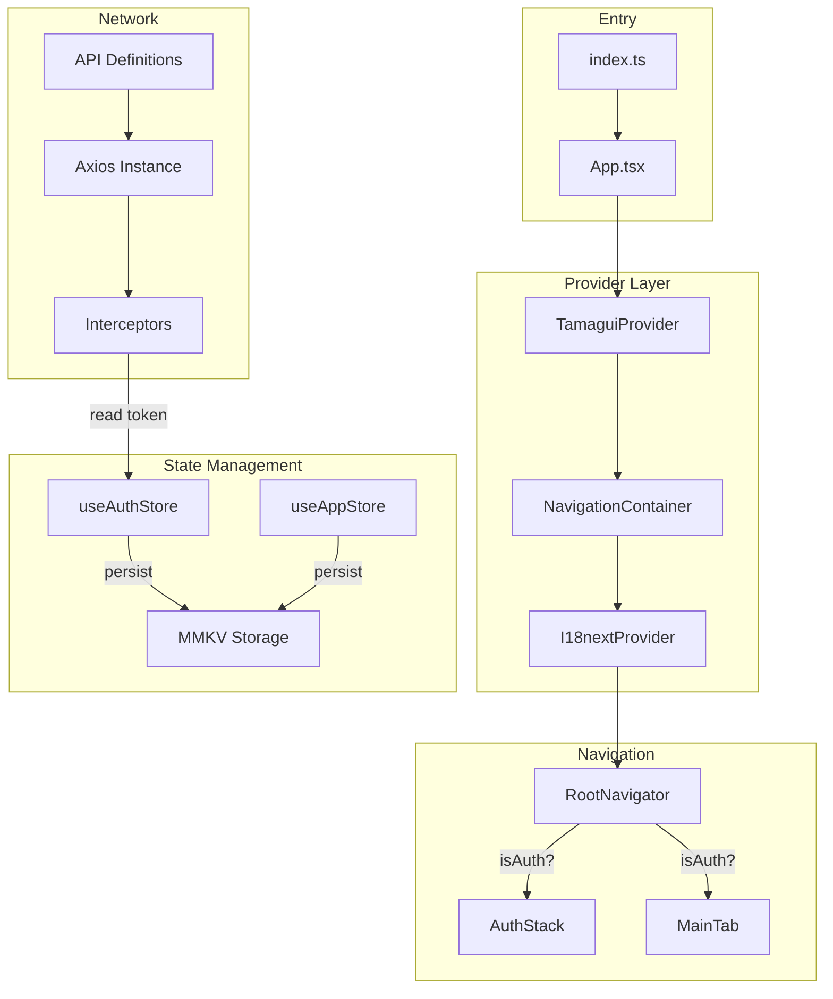

# 生产级 React Native 项目框架搭建

## 技术栈概览


| 模块      | 方案                                                                   |
| ------- | -------------------------------------------------------------------- |
| 框架      | Expo SDK 52 (React Native 0.76, New Architecture)                    |
| 语言      | TypeScript                                                           |
| 包管理     | pnpm                                                                 |
| 导航      | React Navigation v7 (@react-navigation/native + stack + bottom-tabs) |
| 状态管理    | Zustand + zustand/middleware (persist)                               |
| 持久化存储   | react-native-mmkv                                                    |
| UI 组件库  | Tamagui + @tamagui/config                                            |
| 网络请求    | Axios (封装拦截器、错误处理、Token 管理)                                          |
| 国际化     | i18next + react-i18next + expo-localization                          |
| 主题/暗黑模式 | Tamagui 内置主题 + useColorScheme                                        |
| 环境变量    | Expo 内置 EXPO_PUBLIC_ 前缀 + .env 文件                                    |
| 启动页     | expo-splash-screen                                                   |
| 热更新     | expo-updates + EAS Update                                            |


## 项目目录结构

```
rn-demo/
├── app.json
├── tsconfig.json
├── babel.config.js
├── tamagui.config.ts
├── package.json
├── .env                        # 本地环境变量
├── .env.production             # 生产环境变量
├── .gitignore
├── eas.json                    # EAS Build / Update 配置
├── assets/
│   ├── images/
│   │   ├── splash-icon.png
│   │   ├── icon.png
│   │   └── adaptive-icon.png
│   └── fonts/                  # 自定义字体（如需要）
├── src/
│   ├── app/                    # 入口与根布局
│   │   └── App.tsx             # 根组件（Provider 嵌套）
│   ├── navigation/             # 导航配置
│   │   ├── index.tsx           # 根导航器
│   │   ├── types.ts            # 导航类型定义
│   │   ├── MainTab.tsx         # 底部 Tab 导航
│   │   └── AuthStack.tsx       # 登录相关 Stack
│   ├── screens/                # 页面
│   │   ├── HomeScreen.tsx
│   │   ├── ProfileScreen.tsx
│   │   └── LoginScreen.tsx
│   ├── components/             # 通用组件
│   │   ├── Button.tsx          # 基础按钮封装
│   │   ├── Loading.tsx         # 加载指示器
│   │   └── SafeView.tsx        # 安全区域包装
│   ├── services/               # API 服务层
│   │   ├── request.ts          # Axios 实例 + 拦截器封装
│   │   ├── api.ts              # 接口定义
│   │   └── types.ts            # 请求/响应类型
│   ├── store/                  # Zustand 状态管理
│   │   ├── index.ts            # store 统一导出
│   │   ├── useAuthStore.ts     # 认证状态
│   │   └── useAppStore.ts      # 应用全局状态
│   ├── i18n/                   # 国际化
│   │   ├── index.ts            # i18next 初始化
│   │   ├── locales/
│   │   │   ├── zh.ts           # 中文
│   │   │   └── en.ts           # 英文
│   │   └── types.ts            # 类型安全的 key 定义
│   ├── theme/                  # 主题配置
│   │   ├── index.ts            # 导出主题 tokens
│   │   └── navigation.ts       # React Navigation 主题
│   ├── hooks/                  # 自定义 Hooks
│   │   ├── useTheme.ts         # 主题 hook
│   │   └── useStorage.ts       # MMKV 封装 hook
│   ├── utils/                  # 工具函数
│   │   ├── storage.ts          # MMKV 实例 + 工具方法
│   │   └── env.ts              # 环境变量读取封装
│   ├── constants/              # 常量
│   │   └── index.ts            # API_URL 等常量
│   └── types/                  # 全局类型
│       └── global.d.ts         # 全局类型声明
└── index.ts                    # 注册根组件
```

## 实施步骤

### Task 1: 初始化 Expo 项目 + 基础配置

1. 使用 `pnpm create expo-app@latest rn-demo --template blank-typescript` 在 `rn-demo/` 中初始化项目（由于目录已存在，需先清理后在父级创建）
2. 配置 `tsconfig.json` 增加路径别名 `@/*` 指向 `./src/*`
3. 配置 `.gitignore`
4. 创建 `src/` 目录结构

### Task 2: 安装核心依赖

使用 pnpm + `npx expo install` 安装以下依赖包：

**导航相关：**

- `@react-navigation/native`、`@react-navigation/native-stack`、`@react-navigation/bottom-tabs`
- `react-native-screens`、`react-native-safe-area-context`

**UI 组件库：**

- `tamagui`、`@tamagui/config`

**状态管理与存储：**

- `zustand`、`react-native-mmkv`

**网络请求：**

- `axios`

**国际化：**

- `i18next`、`react-i18next`、`expo-localization`

**其他：**

- `expo-splash-screen`、`expo-updates`、`expo-font`、`expo-status-bar`

### Task 3: Tamagui 配置 + 主题系统

- 创建 `tamagui.config.ts`：基于 `@tamagui/config/v3` 创建配置
- 创建 `src/theme/index.ts`：导出主题 tokens
- 创建 `src/theme/navigation.ts`：为 React Navigation 提供 Light/Dark 主题

### Task 4: Axios 请求封装

- 创建 `src/services/request.ts`：
  - 创建 Axios 实例，baseURL 从环境变量读取
  - 请求拦截器：自动注入 Token（从 MMKV 读取）
  - 响应拦截器：统一错误处理、Token 过期处理（401）
  - 支持请求取消、超时配置
- 创建 `src/services/api.ts`：示例接口定义
- 创建 `src/services/types.ts`：统一响应类型

### Task 5: Zustand 状态管理 + MMKV 持久化

- 创建 `src/utils/storage.ts`：MMKV 实例 + StateStorage 适配器
- 创建 `src/store/useAuthStore.ts`：认证 store（token、userInfo、login/logout actions），通过 MMKV persist 中间件持久化
- 创建 `src/store/useAppStore.ts`：应用全局 store（语言、主题偏好）
- 创建 `src/store/index.ts`：统一导出

### Task 6: 国际化 (i18n) 配置

- 创建 `src/i18n/locales/zh.ts` 和 `src/i18n/locales/en.ts`：翻译资源
- 创建 `src/i18n/index.ts`：i18next 初始化，使用 `expo-localization` 检测设备语言
- 创建 `src/i18n/types.ts`：类型安全的翻译 key

### Task 7: 导航系统

- 创建 `src/navigation/types.ts`：所有路由的类型定义
- 创建 `src/navigation/AuthStack.tsx`：登录注册 Stack
- 创建 `src/navigation/MainTab.tsx`：底部 Tab（Home / Profile）
- 创建 `src/navigation/index.tsx`：根导航器，根据认证状态切换 Auth/Main

### Task 8: 基础页面 + 组件

- 创建示例页面：`HomeScreen`、`ProfileScreen`、`LoginScreen`
- 创建通用组件：`SafeView`、`Button`、`Loading`

### Task 9: 环境变量 + 常量

- 创建 `.env` 和 `.env.production`：使用 `EXPO_PUBLIC_` 前缀
- 创建 `src/utils/env.ts`：环境变量读取封装
- 创建 `src/constants/index.ts`：常量定义

### Task 10: 启动页 + EAS Update + 根组件整合

- 配置 `app.json`：splash screen 插件、expo-updates 配置
- 创建 `eas.json`：EAS Build 和 Update 的 profile 配置（development / preview / production）
- 创建 `src/app/App.tsx`：根组件，嵌套 TamaguiProvider -> NavigationContainer -> i18n 初始化
- 更新 `index.ts` 注册根组件
- 启动页在 App 初始化（字体加载、store 恢复）完成后隐藏

### Task 11: 验证与收尾

- 运行 TypeScript 类型检查 `npx tsc --noEmit`
- 检查 linter 错误
- 确保项目可正常通过 `npx expo start` 启动

## 架构数据流




