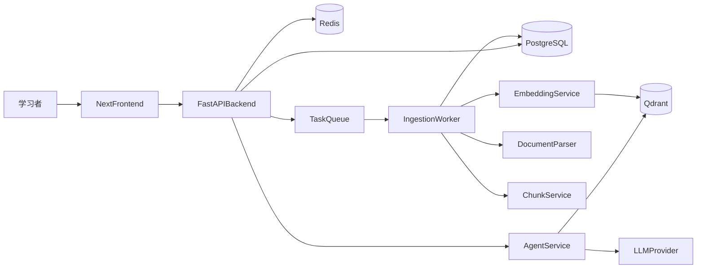

# RAG 学习型知识库底层架构计划

## 目标与边界

- 只在 `[rag-demo](d:\demo\practice-demo\rag-demo)` 目录内搭建，不读取或依赖根目录其它业务项目。
- 目标是先搭好“可运行、可理解、可扩展”的底层框架，功能只保留最小闭环：`文档上传 -> 文档解析/切块 -> 向量入库 -> 问答检索 -> 简单对话展示`。
- 这是学习型项目，所以优先考虑：模块边界清晰、链路完整、后续容易迭代，而不是一次性做复杂功能。
- 默认不做多租户、复杂权限、复杂工作流编排；先做单用户/本地学习版。

## 现状依据

当前目录里只有一个基础设施文件：

- `[docker-compose.yml](d:\demo\practice-demo\rag-demo\docker-compose.yml)`：已经定义了 `Qdrant`、`PostgreSQL`、`Redis`，这意味着底层数据面已经具备：
  - `Qdrant`：向量索引与语义检索
  - `PostgreSQL`：文档、分块、任务、会话等结构化数据
  - `Redis`：缓存、队列、任务状态

这很适合作为学习版 RAG 系统的基础底座，接下来只需要围绕这 3 个依赖补齐应用层。

## 推荐技术选型

为了兼顾学习成本和 AI 生态，建议采用下面这套最小技术栈：

- 前端：`Next.js + React + TypeScript`
- UI：`Ant Design`
- 后端 API：`FastAPI`
- 异步任务：`Celery` 或 `RQ`（优先 `Celery + Redis`，学习资料更多）
- 向量库：`Qdrant`
- 关系库：`PostgreSQL`
- 缓存/队列：`Redis`
- 文档解析：`unstructured` / `pypdf` / `python-docx`（按最小范围逐步接入）
- Embedding / LLM 接入：先用统一 Provider 封装，底层支持 `OpenAI 兼容接口`
- Agent 编排：先做“轻量 Agent 服务层”，不要一开始引入过重框架；等基础链路跑通后再接 `LangGraph`

选择依据：

- 前端用 `Next.js`，目录清晰，适合后续做管理台、SSR、接口代理和部署。
- 后端用 `FastAPI`，天然适合 AI/文档处理/异步任务生态。
- Agent 先做轻编排而不是重框架，便于学习每一层到底在做什么。

## 目标目录结构

建议在 `[rag-demo](d:\demo\practice-demo\rag-demo)` 下按下面结构搭建：

- `frontend/`：前端管理台，负责上传文档、查看文档、发起问答
- `backend/`：后端 API，负责文档管理、检索问答、任务编排入口
- `worker/`：异步处理任务，负责解析、切块、Embedding、写入 Qdrant
- `agent/`：Agent 层，负责 Query Rewrite、Retriever、Prompt、LLM 调用、答案组装
- `packages/shared/`：前后端共享类型、接口约定、常量
- `scripts/`：初始化脚本、建表脚本、索引初始化脚本
- `docs/`：架构图、数据流、接口说明
- `.env.example`：所有环境变量模板
- `README.md`：项目说明、启动方式、架构说明、学习路线

## 总体架构

## 分层职责设计

### 1. 前端层

职责：

- 提供最小管理界面
- 维护上传、文档列表、问答页 3 个核心页面
- 调用后端 API，不直接接触向量库和模型

最小页面建议：

- `/documents`：文档列表页
- `/documents/upload`：文档上传页
- `/chat`：知识库问答页
- `/tasks`：查看解析/索引任务状态页

前端最小能力：

- 上传 `txt/md/pdf`
- 查看文档状态：`待处理 / 处理中 / 已完成 / 失败`
- 输入问题并展示回答
- 展示引用片段与来源文档名

### 2. 后端 API 层

职责：

- 提供 REST API
- 管理文档元数据、任务状态、会话记录
- 对接异步任务系统
- 在问答场景中调用 Agent 层

建议拆分模块：

- `routers/documents.py`
- `routers/chat.py`
- `routers/tasks.py`
- `services/document_service.py`
- `services/task_service.py`
- `services/chat_service.py`
- `repositories/`：封装数据库访问
- `core/config.py`：环境变量配置
- `core/logging.py`：统一日志

### 3. Worker 异步处理层

职责：

- 解析上传文档
- 做文本清洗
- 做分块
- 调用 Embedding
- 写入 Qdrant
- 更新 Postgres 中的任务状态与文档状态

建议任务拆分：

- `parse_document`
- `split_chunks`
- `embed_chunks`
- `upsert_vectors`
- `mark_document_ready`

这样做的依据是：学习阶段要把摄取流程拆开，便于单独调试每一步。

### 4. Agent 层

职责：

- 统一处理问答链路
- 负责检索、上下文构造、Prompt 组装、模型调用、答案引用整理
- 对外只暴露一个 `ask()` 或 `run_chat()` 接口给后端调用

最小 Agent 设计：

- `query_rewriter`：可先留空实现，默认原样返回问题
- `retriever`：从 Qdrant 召回 TopK 片段
- `reranker`：第一版可以不做，保留接口
- `prompt_builder`：把问题和召回片段拼成 Prompt
- `llm_client`：调用 LLM
- `answer_formatter`：生成最终答案和引用来源

学习版先不做复杂多 Agent，只做单 Agent / 单链路，这样最容易理解系统本质。

## 核心数据模型

建议先设计 4 张核心表：

- `documents`
  - `id`
  - `file_name`
  - `file_type`
  - `storage_path`
  - `status`
  - `created_at`
  - `updated_at`
- `document_chunks`
  - `id`
  - `document_id`
  - `chunk_index`
  - `content`
  - `token_count`
  - `metadata_json`
- `ingestion_tasks`
  - `id`
  - `document_id`
  - `status`
  - `error_message`
  - `started_at`
  - `finished_at`
- `chat_messages`
  - `id`
  - `session_id`
  - `role`
  - `content`
  - `references_json`
  - `created_at`

Qdrant 中每个 point 至少包含：

- `id`
- `vector`
- `payload.document_id`
- `payload.chunk_id`
- `payload.file_name`
- `payload.chunk_index`
- `payload.text`

这样设计的依据是：`Postgres` 负责业务主数据，`Qdrant` 负责检索副本，二者职责清晰。

## 核心接口设计

建议最先落下面这些 API：

- `POST /api/documents/upload`
  - 上传文件，写入 `documents`
  - 创建 `ingestion_task`
  - 投递异步任务
- `GET /api/documents`
  - 文档列表
- `GET /api/documents/{id}`
  - 文档详情与状态
- `GET /api/tasks/{id}`
  - 查询处理任务状态
- `POST /api/chat/ask`
  - 输入问题，返回答案与引用片段
- `GET /api/health`
  - 健康检查

第一版先不要做删除重建、版本历史、批量上传等扩展能力。

## 从 0 到 1 的落地步骤

### 步骤 1：明确学习版范围并固化 README

输出：

- 明确系统只做最小闭环
- README 中先写清楚：项目目标、功能范围、不做什么、整体架构图

依据：先锁边界，后面目录与代码才不会发散。

### 步骤 2：保留并增强基础设施层

基于 `[docker-compose.yml](d:\demo\practice-demo\rag-demo\docker-compose.yml)`：

- 保留 `Qdrant`、`PostgreSQL`、`Redis`
- 补一个 `.env.example`
- 后续需要新增：
  - `backend` 服务
  - `worker` 服务
  - `frontend` 服务

建议同时补齐：

- `postgres` 初始化脚本挂载
- `backend/worker` 的健康检查
- 公共网络与服务依赖顺序

### 步骤 3：初始化目录骨架

在 `rag-demo` 下创建：

- `frontend/`
- `backend/`
- `worker/`
- `agent/`
- `packages/shared/`
- `scripts/`
- `docs/`

每个目录先完成最小骨架：

- 前端能启动空页面
- 后端能启动空 API
- Worker 能消费一个测试任务
- Agent 层能被后端调用并返回 mock 数据

依据：先打通工程化骨架，再填 AI 能力，排错成本最低。

### 步骤 4：先完成后端基础框架

后端第一批必须完成：

- `FastAPI` 项目初始化
- 配置管理：`env -> config`
- 数据库连接：`Postgres`
- Redis 连接
- 统一日志
- 路由分层
- 异常处理中间件
- 健康检查接口

建议最小模块顺序：

1. `app/main.py`
2. `core/config.py`
3. `db/session.py`
4. `models/`
5. `schemas/`
6. `routers/`
7. `services/`

### 步骤 5：完成文档摄取链路

最小链路：

1. 前端上传文件到后端
2. 后端记录文档元数据
3. 后端投递异步任务
4. Worker 读取文件
5. 解析文本
6. 文本切块
7. 调用 Embedding
8. 写入 Qdrant
9. 更新任务状态为完成

第一版建议只支持：

- `md`
- `txt`
- `pdf`

依据：这 3 类格式最适合学习阶段验证全链路。

### 步骤 6：完成检索问答链路

最小问答链路：

1. 前端提交问题
2. 后端调用 Agent 服务
3. Agent 检索 Qdrant TopK 片段
4. Agent 组装 Prompt
5. Agent 调用 LLM
6. Agent 返回答案 + 引用来源
7. 后端持久化聊天记录
8. 前端展示答案和引用

建议第一版固定参数：

- `top_k = 5`
- `chunk_size = 500 ~ 800`
- `chunk_overlap = 50 ~ 100`

### 步骤 7：设计 Agent 的最小可扩展接口

建议在 `agent/` 里定义统一入口，例如：

- `run_chat(question, session_id)`
- `retrieve_context(question)`
- `build_prompt(question, contexts)`
- `generate_answer(prompt)`

这样后续要扩展：

- Query Rewrite
- Rerank
- 多轮记忆
- Tool Use
- LangGraph

都可以在不推翻现有结构的前提下演进。

### 步骤 8：设计前端最小交互框架

前端优先搭 3 个页面和 1 个公共请求层：

- 文档上传页
- 文档列表页
- 问答页
- `api client` 封装

页面级重点：

- 上传页支持文件选择和状态提示
- 列表页支持轮询任务状态
- 问答页支持展示引用片段

学习阶段无需复杂状态管理，优先使用：

- `React Query` 管接口缓存
- 页面内局部状态处理交互

### 步骤 9：加入最小可观测性

至少补齐：

- 请求日志
- 任务日志
- 错误日志
- 文档处理失败原因
- 每次问答的检索片段记录

依据：RAG 系统最难排查的问题，通常不是“代码报错”，而是“为什么没召回 / 为什么答错”。

### 步骤 10：补齐初始化与本地启动脚本

建议新增：

- `scripts/init_db.*`
- `scripts/init_qdrant.*`
- `scripts/dev_start.*`
- `scripts/dev_reset.*`

目标：让学习者只需要几个命令就能跑起整套系统。

### 步骤 11：完善 README

README 第一版建议包含：

- 项目简介
- 为什么选择这套技术栈
- 系统架构图
- 目录结构说明
- 本地启动步骤
- 环境变量说明
- 最小功能演示流程
- 后续迭代路线图

因为当前目录还没有 README，所以这一步应当明确创建 `[README.md](d:\demo\practice-demo\rag-demo\README.md)`。

### 步骤 12：把计划文档落盘到当前目录

在执行阶段，将本计划同步保存到 `[rag-demo](d:\demo\practice-demo\rag-demo)` 当前目录下，建议文件名：

- `plan-20260324-rag-learning-architecture.md`

这样后续你边学边做时，可以直接对照计划推进。

## 建议实施顺序

建议分 4 个里程碑推进：

1. `M1 基础设施与工程骨架` **[已完成 Step 1]**
  - 完成目录、README、`.env.example`、前后端/worker 启动骨架
2. `M2 文档摄取链路`
  - 完成上传、解析、切块、Embedding、入库、任务状态
3. `M3 检索问答链路` **[已完成 Step 5/6]**
  - 完成检索、Prompt、LLM、引用展示
4. `M4 可观测与扩展预留`
  - 完成日志、脚本、Agent 接口抽象、后续扩展点

## 交付结果定义

当这一轮底层框架搭建完成时，应达到下面标准：

- 本地一条命令可以启动基础依赖与应用服务
- 可以上传一个 `md/txt/pdf` 文档
- 可以看到该文档从“待处理”变成“已完成”
- 可以在问答页提问并得到基于文档内容的回答
- 回答里能展示引用来源
- README 足够让另一个人照着跑通系统

## 本轮执行时优先修改/新增的文件

- 现有基础文件：
  - `[docker-compose.yml](d:\demo\practice-demo\rag-demo\docker-compose.yml)`
- 计划新增的关键文件：
  - `[README.md](d:\demo\practice-demo\rag-demo\README.md)`
  - `[.env.example](d:\demo\practice-demo\rag-demo\.env.example)`
  - `[frontend/package.json](d:\demo\practice-demo\rag-demo\frontend\package.json)`
  - `[backend/app/main.py](d:\demo\practice-demo\rag-demo\backend\app\main.py)`
  - `[worker/app/tasks.py](d:\demo\practice-demo\rag-demo\worker\app\tasks.py)`
  - `[agent/service.py](d:\demo\practice-demo\rag-demo\agent\service.py)`
  - `[docs/architecture.md](d:\demo\practice-demo\rag-demo\docs\architecture.md)`

## 默认实现原则

- 先跑通，再抽象
- 先单机本地版，再考虑云部署
- 先单用户，再考虑权限
- 先单 Agent 单链路，再考虑复杂编排
- 所有配置通过环境变量注入，不在仓库中硬编码密钥
