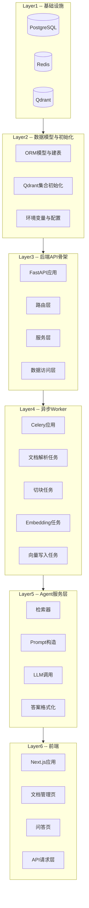

# RAG 知识库 -- 逐层搭建计划（从底层到顶层）

## 分层架构总览

整个系统分 6 层，严格从下往上搭建，每次只做一层：

## 搭建顺序与每层详细内容

---

### Step 1: 基础设施层 (Infrastructure)

**聚焦模块**: `docker-compose.yml` + `.env.example` + `scripts/`

**做什么**:

- 在现有 [docker-compose.yml](rag-demo/docker-compose.yml) 基础上，补齐网络、健康检查、初始化脚本挂载
- 新增 Postgres 初始化 SQL 脚本（`scripts/init_db.sql`），挂载到容器 `docker-entrypoint-initdb.d`
- 新增 Qdrant 集合初始化脚本（`scripts/init_qdrant.py`），可独立运行
- 创建 `.env.example`，列出所有环境变量及默认值
- 创建 `README.md` 第一版，先写项目目标、技术选型、架构图

**新增/修改文件**:

- [docker-compose.yml](rag-demo/docker-compose.yml) -- 修改
- [.env.example](rag-demo/.env.example) -- 新增
- [scripts/init_db.sql](rag-demo/scripts/init_db.sql) -- 新增
- [scripts/init_qdrant.py](rag-demo/scripts/init_qdrant.py) -- 新增
- [README.md](rag-demo/README.md) -- 新增

**验证标准**: `docker compose up -d` 能拉起 3 个依赖服务，Postgres 自动建表，README 能看到架构图。

---

### Step 2: 数据模型与配置层 (Models & Config)

**聚焦模块**: `backend/app/core/` + `backend/app/db/` + `backend/app/models/` + `backend/app/schemas/`

**做什么**:

- 初始化 `backend/` Python 项目，创建 `requirements.txt` / `pyproject.toml`
- 实现配置管理 `core/config.py`（用 pydantic-settings 读 .env）
- 实现数据库会话 `db/session.py`（SQLAlchemy async engine + sessionmaker）
- 定义 4 张核心 ORM 模型:
  - `models/document.py` -- documents 表
  - `models/chunk.py` -- document_chunks 表
  - `models/task.py` -- ingestion_tasks 表
  - `models/chat.py` -- chat_messages 表
- 定义对应的 Pydantic schemas（请求/响应 DTO）
- 实现 `db/init_db.py`（用 Alembic 或 metadata.create_all 建表）

**新增文件**:

- [backend/requirements.txt](rag-demo/backend/requirements.txt)
- [backend/app/init.py](rag-demo/backend/app/__init__.py)
- [backend/app/core/config.py](rag-demo/backend/app/core/config.py)
- [backend/app/db/session.py](rag-demo/backend/app/db/session.py)
- [backend/app/db/init_db.py](rag-demo/backend/app/db/init_db.py)
- [backend/app/models/document.py](rag-demo/backend/app/models/document.py)
- [backend/app/models/chunk.py](rag-demo/backend/app/models/chunk.py)
- [backend/app/models/task.py](rag-demo/backend/app/models/task.py)
- [backend/app/models/chat.py](rag-demo/backend/app/models/chat.py)
- [backend/app/schemas/](rag-demo/backend/app/schemas/)

**验证标准**: 可以通过 `python -m app.db.init_db` 连接 Postgres 并成功建表，`config.py` 能正确读取 `.env`。

---

### Step 3: 后端 API 骨架 (Backend API)

**聚焦模块**: `backend/app/main.py` + `backend/app/routers/` + `backend/app/services/` + `backend/app/repositories/`

**做什么**:

- 创建 FastAPI 应用入口 `main.py`（含 CORS、异常处理中间件、生命周期事件）
- 创建 `Dockerfile` 用于后端容器化
- 实现数据访问层 `repositories/`（封装 CRUD）
- 实现业务服务层 `services/`（document_service, task_service, chat_service）
- 实现路由层:
  - `routers/health.py` -- `GET /api/health`
  - `routers/documents.py` -- `POST /api/documents/upload`, `GET /api/documents`, `GET /api/documents/{id}`
  - `routers/tasks.py` -- `GET /api/tasks/{id}`
  - `routers/chat.py` -- `POST /api/chat/ask`（此时先返回 mock 数据）
- 更新 `docker-compose.yml` 加入 backend 服务

**新增/修改文件**:

- [backend/app/main.py](rag-demo/backend/app/main.py)
- [backend/Dockerfile](rag-demo/backend/Dockerfile)
- [backend/app/routers/health.py](rag-demo/backend/app/routers/health.py)
- [backend/app/routers/documents.py](rag-demo/backend/app/routers/documents.py)
- [backend/app/routers/tasks.py](rag-demo/backend/app/routers/tasks.py)
- [backend/app/routers/chat.py](rag-demo/backend/app/routers/chat.py)
- [backend/app/services/](rag-demo/backend/app/services/)
- [backend/app/repositories/](rag-demo/backend/app/repositories/)
- [docker-compose.yml](rag-demo/docker-compose.yml) -- 修改

**验证标准**: `docker compose up backend` 启动后，访问 `http://localhost:8000/docs` 能看到 Swagger 文档，`/api/health` 返回 200，文档上传接口能写入 Postgres。

---

### Step 4: 异步 Worker 层 (Celery Worker)

**聚焦模块**: `worker/`

**做什么**:

- 初始化 Celery 应用，broker 连 Redis
- 实现文档摄取管线，拆成 5 个独立 task:
  - `tasks/parse_document.py` -- 读文件、抽取纯文本（支持 txt/md/pdf）
  - `tasks/split_chunks.py` -- 按固定窗口+重叠切块
  - `tasks/embed_chunks.py` -- 调用 Embedding API 生成向量
  - `tasks/upsert_vectors.py` -- 写入 Qdrant
  - `tasks/mark_complete.py` -- 更新 Postgres 任务/文档状态
- 实现管线编排 `pipeline.py`（用 Celery chain 串联上述 5 步）
- 创建 `Dockerfile` 用于 Worker 容器化
- 更新 `docker-compose.yml` 加入 worker 服务
- 修改 backend 的 `document_service`，在上传完成后调用 `pipeline.delay()`

**新增/修改文件**:

- [worker/app/celery_app.py](rag-demo/worker/app/celery_app.py)
- [worker/app/tasks/parse_document.py](rag-demo/worker/app/tasks/parse_document.py)
- [worker/app/tasks/split_chunks.py](rag-demo/worker/app/tasks/split_chunks.py)
- [worker/app/tasks/embed_chunks.py](rag-demo/worker/app/tasks/embed_chunks.py)
- [worker/app/tasks/upsert_vectors.py](rag-demo/worker/app/tasks/upsert_vectors.py)
- [worker/app/tasks/mark_complete.py](rag-demo/worker/app/tasks/mark_complete.py)
- [worker/app/pipeline.py](rag-demo/worker/app/pipeline.py)
- [worker/Dockerfile](rag-demo/worker/Dockerfile)
- [worker/requirements.txt](rag-demo/worker/requirements.txt)
- [docker-compose.yml](rag-demo/docker-compose.yml) -- 修改
- [backend/app/services/document_service.py](rag-demo/backend/app/services/document_service.py) -- 修改

**验证标准**: 上传一个 txt/md 文件后，Worker 日志能看到 5 步依次执行，Postgres 中文档状态变为 `completed`，Qdrant 中能查到对应向量。

---

### Step 5: Agent 服务层 (Agent Service)

**聚焦模块**: `agent/`

**做什么**:

- 创建 Agent 统一入口 `service.py`，暴露 `run_chat(question, session_id)` 接口
- 实现检索模块 `retriever.py` -- 调 Qdrant 搜索 TopK 片段
- 实现 Prompt 构造模块 `prompt_builder.py` -- 组装系统提示词 + 检索上下文 + 用户问题
- 实现 LLM 调用模块 `llm_client.py` -- 封装 OpenAI 兼容接口
- 实现答案格式化 `answer_formatter.py` -- 提取引用来源
- 预留接口位:
  - `query_rewriter.py` -- 第一版直接返回原始问题
  - `reranker.py` -- 第一版直接返回检索结果
- 修改 backend 的 `chat_service.py`，把 mock 替换为调用 Agent
- 修改 backend 的 `routers/chat.py`，支持流式返回（SSE）

**新增/修改文件**:

- [agent/init.py](rag-demo/agent/__init__.py)
- [agent/service.py](rag-demo/agent/service.py)
- [agent/retriever.py](rag-demo/agent/retriever.py)
- [agent/prompt_builder.py](rag-demo/agent/prompt_builder.py)
- [agent/llm_client.py](rag-demo/agent/llm_client.py)
- [agent/answer_formatter.py](rag-demo/agent/answer_formatter.py)
- [agent/query_rewriter.py](rag-demo/agent/query_rewriter.py)
- [agent/reranker.py](rag-demo/agent/reranker.py)
- [backend/app/services/chat_service.py](rag-demo/backend/app/services/chat_service.py) -- 修改
- [backend/app/routers/chat.py](rag-demo/backend/app/routers/chat.py) -- 修改

**验证标准**: 通过 curl 或 Swagger 调用 `POST /api/chat/ask`，能基于已入库的文档内容返回答案并带引用来源。

---

### Step 6: 前端层 (Frontend)

**聚焦模块**: `frontend/`

**做什么**:

- 用 Next.js + TypeScript 初始化项目
- 引入 Ant Design 作为 UI 组件库
- 封装 API 请求层 `lib/api-client.ts`
- 实现 3 个核心页面:
  - `/documents` -- 文档列表，展示状态，支持轮询
  - `/documents/upload` -- 文件上传，展示上传进度和处理状态
  - `/chat` -- 问答对话，展示引用片段和来源
- 创建 `Dockerfile` 用于前端容器化
- 更新 `docker-compose.yml` 加入 frontend 服务

**新增/修改文件**:

- [frontend/package.json](rag-demo/frontend/package.json)
- [frontend/Dockerfile](rag-demo/frontend/Dockerfile)
- [frontend/src/lib/api-client.ts](rag-demo/frontend/src/lib/api-client.ts)
- [frontend/src/app/documents/page.tsx](rag-demo/frontend/src/app/documents/page.tsx)
- [frontend/src/app/documents/upload/page.tsx](rag-demo/frontend/src/app/documents/upload/page.tsx)
- [frontend/src/app/chat/page.tsx](rag-demo/frontend/src/app/chat/page.tsx)
- [docker-compose.yml](rag-demo/docker-compose.yml) -- 修改

**验证标准**: 浏览器访问 `http://localhost:3000`，能上传文档、看到处理状态、在问答页提问并得到带引用的回答。

---

### Step 7: 收尾 -- 文档与脚本

**聚焦模块**: `README.md` + `docs/` + `scripts/`

**做什么**:

- 完善 README：补齐完整启动步骤、环境变量说明、最小演示流程、迭代路线图
- 创建 `docs/architecture.md`：完整架构说明和数据流图
- 补齐一键启动/重置脚本:
  - `scripts/dev_start.sh` -- 一键拉起全部服务
  - `scripts/dev_reset.sh` -- 清除数据重新初始化
- 更新 plan 文件标记所有步骤已完成

**修改文件**:

- [README.md](rag-demo/README.md) -- 完善
- [docs/architecture.md](rag-demo/docs/architecture.md) -- 新增
- [scripts/dev_start.sh](rag-demo/scripts/dev_start.sh) -- 新增
- [scripts/dev_reset.sh](rag-demo/scripts/dev_reset.sh) -- 新增

**验证标准**: 另一个人克隆仓库后，照着 README 执行 3 条命令就能跑通完整链路。

---

## 执行原则

- 每个 Step 完成并验证后，再开始下一个 Step
- 每个 Step 做完后更新 README 中对应部分
- 不跨层引入依赖（例如 Step 2 不写路由，Step 3 不写 Worker）
- 所有配置通过 `.env` 注入，不硬编码密钥
- 先跑通再抽象，先单机再容器化

